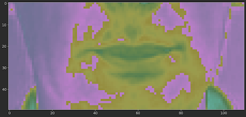

# LipNet Model Implementation

This repository hosts an implementation of the Lipreading model as detailed in the research paper ["LipNet: End-to-End Sentence-level Lipreading"](https://arxiv.org/abs/1611.01599). 
It features a Convolutional Neural Network (CNN) designed to translate video sequences of spoken words into their corresponding textual representation.

## Dataset

The implementation leverages the GRID corpus, as utilized in the original LipNet study. 
The dataset is directly sourced from Google Drive, courtesy of Nikolas Renotte's version, which conveniently combines both video inputs and alignment files in a single folder for streamlined access.

## Data Processing

The primary input comprises video recordings, each capturing a subject articulating a sequence of no more than ten words, resembling chess move notations.
These videos are segmented into 75 distinct frames. Each frame is cropped to focus solely on the dynamic aspects of the face, particularly the mouth.
Additionally, standardization is applied to these frames to accentuate the features of the moving mouth.
This is an example of a frame from the dataset:



Included in the dataset are alignment files that detail the spoken words. Below is a sample structure of an alignment file:

```
0 23750 sil
23750 29500 bin
29500 34000 blue
34000 35500 at
35500 41000 f
41000 47250 two
47250 53000 now
53000 74500 sil
```


In the preprocessing phase, 'sil' markers, denoting silence, are omitted, and the remaining words are concatenated. Subsequently, an integer-based encoding scheme is employed to embed the letters.

## Model Architecture

The core of this implementation is a 3D Convolutional Neural Network. It accepts input sequences comprising 75 frames, each with a resolution of 50x100 pixels.
The network's architecture includes a series of 3D convolutional layers, 3D max pooling layers, and 3D fully connected layers, supplemented by Bidirectional GRU (Gated Recurrent Unit) layers. 

## Loss Function

CTC (Connectionist Temporal Classification) loss function is employed here, given its suitability for the task at hand. 
It is particularly advantageous for training on datasets that exhibit potential misalignment due to periods of silence at the beginning and end of each recording.

## Training Protocol

The training includes a learning rate scheduler, which reduces the learning rate by a factor of 10 at the 5th epochs. 
Due to limitations imposed by my local computational resources, the model is trained over a span of 10 epochs. 
An Adam optimizer is utilized to optimize the CTC loss function during the training process.
